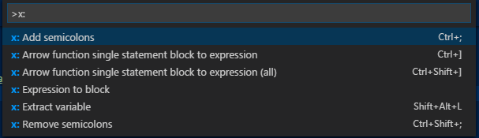

# vscode-refactorix
TypeScript refactoring tools for Visual Studio Code.

After installing, pressing `F1` and entering `x:` you should see the Refactorix commands in the drop down:



## Refactorings

### Interpolate string part

Surrounds the selected part of a string literal with `${}` and converts the literal to backticks as necessary.

Before - assume you have `refactorix` selected:
```
'my name is refactorix.'
```

After - note the backticks:
```
`my name is ${refactorix}.`
```

Select a part of a string literal and invoke the command. The selection may be empty in which case `${}` is inserted.

### Property to getter/setter
Converts a property to getter/setter.

Before:
```
class Color {
    rgb: string;
}
```

After:
```
class Color {
    private _rgb: string;
    get rgb(): string {
        return this._rgb;
    }
    set rgb(value: string) {
        this._rgb = value;
    }
}
```

Place the cursor on a property and invoke the command.

#### Settings
Add this configuration block to the VS Code 'User' or 'Workspace' settings:
```
"extension.refactorix.Property.ToGetterSetter": {
    "singleLine": false,
     "prefix": "_"
}
```

`singleLine` - if `true`, getter and setter will be written on a single line.

`prefix` - Prefix for the property.

### Add/remove semicolons
Adds or removes semicolons for all statements in the active document.

### Arrow function toggle single statement block <-> expression
Toggles between an arrow function's single statement block and expression.

Toggles between this:
```
() => 0;
```

and this:
```
() => {
    return 0;
};
```

Place the cursor inside such a function and invoke the command.

### Arrow function all single statement blocks to expression
Converts all arrow function single statement blocks to expression.

### Extract variable
Replaces the selected text with a `const` variable declaration. This command operates on text rather than AST, so the location of the variable declaration may not be appropriate in all cases.

## Assign a shortcut
Insert this into your `keybindings.json`:
```
{
    "key": "ctrl+;",
    "command": "extension.refactorix.Semicolons.Add",
    "when": "editorTextFocus"
},
{
    "key": "ctrl+shift+;",
    "command": "extension.refactorix.Semicolons.Remove",
    "when": "editorTextFocus"
},
{
    "key": "ctrl+]",
    "command": "extension.refactorix.ArrowFunction.ToggleSingleStatementBlockExpression",
    "when": "editorTextFocus"
},
{
    "key": "ctrl+shift+]",
    "command": "extension.refactorix.ArrowFunction.SingleStatementBlockToExpressionAll",
    "when": "editorTextFocus"
},
{
    "key": "alt+shift+l",
    "command": "extension.refactorix.ExtractVariable"
},
{
    "key": "shift+alt+x i",
    "command": "extension.refactorix.String.Interpolate",
    "when": "editorTextFocus"
},
{
    "key": "shift+alt+x g",
    "command": "extension.refactorix.Property.ToGetterSetter",
    "when": "editorTextFocus"
},
```

## Release Info

v0.1.0
- Initial release

v0.2.0
- Semicolons are now added/removed in all the places where tslint's semicolon rule reports a problem
- New refactoring 'Property to getter/setter'
- New refactoring 'Interpolate string part'

## Development setup
- run `npm install` inside the project folder
- open VS Code on the project folder

## Build
- run `npm run compile`

## Package
- run `vsce package`

